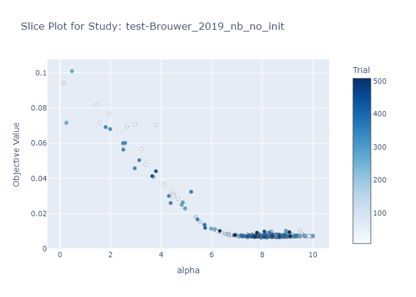
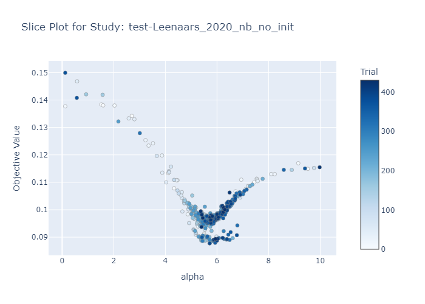
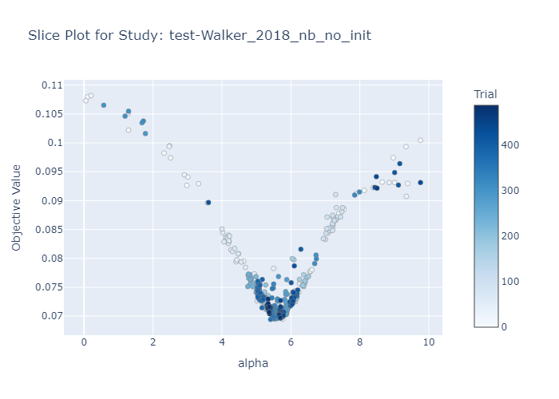
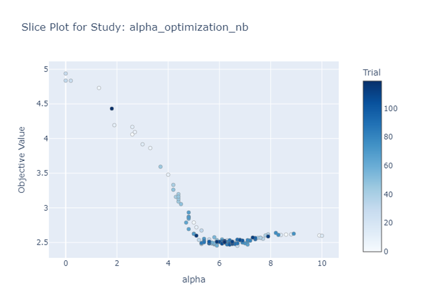

# ASReview Hyper-Hyper

## Why Optuna?
Initially, Hyperopt was used for optimization, but after some investigation, Optuna was selected as a better-suited framework. Optuna outperforms Hyperopt in several areas, including ease of use, built-in pruning, visualization capabilities, and faster convergence.

Useful links:
[Optuna vs Hyperopt](https://neptune.ai/blog/optuna-vs-hyperopt)
[A Deep Dive into Optuna vs. Hyperopt for Hyperparameter Optimization Excellence](https://medium.com/@Umarzaib/a-deep-dive-into-optuna-vs-hyperopt-for-hyperparameter-optimization-excellence-5d6fe17481c3)
[Optuna vs Hyperopt in Python](https://www.educative.io/answers/optuna-vs-hyperopt-in-python)

## How Optuna Works
Optuna requires defining an objective function, which is central to the optimization process. The function specifies the model to be used, how data is loaded, and, most importantly, the value to optimize.

[Optuna Tutorial](https://optuna.readthedocs.io/en/stable/tutorial/index.html)

### Type of Sampler
After reviewing Optuna’s sampler options, the TPESampler was chosen due to its stochastic descent approach, enabling convergence with relatively few trials. TPESampler is computationally efficient, with a complexity of O(dn log n), where d is the number of trials and n the number of variables.

### Number of Trials
Following Optuna’s recommendations, 500 trials were selected for optimization, falling within the suggested range of 100-1000 trials. 

More details on samplers and number of trials can be found in the [Optuna documentation](https://optuna.readthedocs.io/en/stable/reference/samplers/index.html).

## Model Selection for Optimization
The initial model for optimization was from the ASReview NEMO package, with XGBoost being the starting point since it lacked prior parameter optimization. However, the focus later shifted to optimizing Naïve Bayes for faster results and to validate the approach, given its simplicity.

## Alpha Value Optimization
Naïve Bayes has a single hyperparameter, the alpha value. Various sources suggested different ranges for alpha, leading to the decision to experiment with a range from 0 to 10, with a step size of 0.01. A logarithmic function was then implemented to address gaps in the range. Eventually, Optuna's built-in function was used, providing a more streamlined approach.

## Loss Function
Initially, WSS@95 was used as the loss function, with Optuna attempting to minimize this value. However, after feedback, it was decided to optimize based on the difference between the perfect recall line and the model's output. Two approaches were implemented, and the more "elegant" version was selected, though both yielded the same results.

More on the loss function and the different metrics can be found in the [ASReview Insights Repo](https://github.com/asreview/asreview-insights).

## ASReview Simulation
The simulation setup was inspired by previous work with the NEMO package, with two modifications:
1. Increasing the number of instances to 5 to reduce simulation time without affecting results.
2. Removing the model seed to enhance randomness.

## Parallelization
Early tests revealed low CPU usage, prompting the prioritization of parallelization. Initially, multiple command lines were used to run Python scripts concurrently, as recommended by [Optuna’s documentation](https://optuna.readthedocs.io/en/stable/tutorial/10_key_features/004_distributed.html). 

However, this caused issues with file access, which were resolved by implementing temporary files. Parallelization was later integrated into the code, allowing users to specify the number of CPUs directly. The `concurrent.futures` Python library was chosen for its ease of use, and temporary files were handled via the `tempfile` library.

## Dataset - Synergy
The Synergy dataset was used throughout the process. Initially, only a few datasets were used for testing, but later, the entire Synergy dataset was employed. Pre-downloading the dataset was found to streamline the optimization process by allowing the objective function to focus solely on optimization.

More information on the Synergy dataset can be found [here](https://github.com/asreview/synergy-dataset).

### Optimization Per Dataset
The first approach involved optimizing the model for each dataset individually, providing insights into how different datasets affected the model. Some datasets converged well, while others favored extremely high alpha values, helping to identify "problematic" datasets.

#### Here are some examples:






### Optimization Across All Datasets

#### Accumulative Loss
The next step was to run the optimization across all datasets simultaneously, accumulating the losses and optimizing based on this accumulated loss.



#### Loss Per Dataset
Instead of simply accumulating losses, each dataset's loss was saved in an array, and the optimization was adjusted to minimize the entire array. This approach provided insights into why certain datasets favored large alpha values, particularly those with steep curves in the simulations.

#### Smart Loss
A decision was made to retain all datasets, including problematic ones that did not minimize well. A "smart loss" function was developed to assign greater importance to datasets that converged and to penalize those that did not. This ensured that well-performing datasets had a larger impact on the optimization process.

## Client
A Python command-line client was developed to allow users to replicate and run their own simulations without modifying the code. The client offers three main options:
- Download the Synergy Dataset.
- Optimize a model.
- Generate plots from the resulting database.
The structure of the simulation folder is as follows:

```text
../simulation_name
    ../plots
    ../db_file
```
The dataset is saved in a “data” folder within the same directory as the Python file. The Fire library was used to implement the command-line interface.
